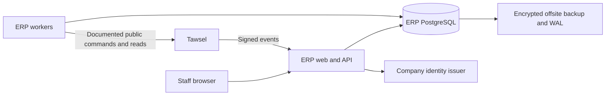

# Shahn ERP master plan

Revision: PLAN-001. Prepared 2026-10-03, Africa/Cairo. **Status: approved for phase authoring in session025 under ERP-D-205; implementation and runtime acceptance remain unstarted.**

This plan turns the approved discovery into an implementation contract for a real shipping ERP. The layout/design direction is approved as UI-REV-001. The application stack direction is approved. The detailed design choices were adopted together under ERP-D-205. Their original proposal IDs remain for provenance; named external-contract dependencies and unverified targets remain unresolved facts. The existing isolated UI prototype is the only application artifact produced so far.

Start later execution from [the phase catalog](phases/README.md), beginning with P01 after checking its prerequisites. Execute one complete phase prompt at a time.

## How to read this package

Start here for the complete system and recorded design choices. The linked specifications are required parts of this plan, not optional background. An implementation prompt must include its applicable rules and exact reading references so a fresh agent can work without the chat.

| Document | Purpose |
| --- | --- |
| [ERP-DOMAIN-SPEC.md](docs/planning/ERP-DOMAIN-SPEC.md) | Commercial rules, normal and exceptional journeys, money examples and domain acceptance cases |
| [ERP-DATA-AND-TRANSACTIONS.md](docs/planning/ERP-DATA-AND-TRANSACTIONS.md) | Records, constraints, states, atomic commands, concurrency and correction mechanics |
| [ERP-TAWSEL-INTEGRATION-PLAN.md](ERP-TAWSEL-INTEGRATION-PLAN.md) | Exact existing integration authority/operations/events, mapping, persistence and recovery |
| [INTEGRATION-CONTRACT-COVERAGE.md](docs/planning/INTEGRATION-CONTRACT-COVERAGE.md) | Actual contract reading, selected dependency coverage, failure evidence and remaining gaps |
| [ERP-SCREEN-SPEC.md](docs/planning/ERP-SCREEN-SPEC.md) | Screen inventory, purpose, fields, scope, navigation, advanced filters and visual acceptance |
| [ERP-ARCHITECTURE-AND-OPERATIONS.md](docs/planning/ERP-ARCHITECTURE-AND-OPERATIONS.md) | Concrete architecture proposals, identity, APIs, deployment, capacity, costs and recovery |
| [REQUIREMENTS-TRACEABILITY.md](REQUIREMENTS-TRACEABILITY.md) | All 214 requirements and 205 decisions, current/superseded scope, implementation owners and acceptance/verification; phase ownership is recorded with the authored phase catalog |
| [PHASE-AUTHORING-STANDARD.md](docs/planning/PHASE-AUTHORING-STANDARD.md) | Required depth and checks applied to the complete PHASES-001 prompts |
| [IMPLEMENTATION-STATUS.md](IMPLEMENTATION-STATUS.md) | Honest starting status and the evidence record later execution must maintain |

Authority: latest explicit owner choice, then its English decision/requirement record; pinned Tawsel contracts determine existing external capability. The selected plan mechanics fill engineering gaps under ERP-D-205. Historical rows remain in [ERP-DECISIONS.md](ERP-DECISIONS.md), [ERP-DISCOVERY-LOG.md](ERP-DISCOVERY-LOG.md) and [ERP-OPEN-QUESTIONS.md](ERP-OPEN-QUESTIONS.md); an older row never silently overrides its later amendment. A mismatch between owner intent and an external contract becomes an explicit integration dependency/change request.

The newly inspected `tawsel-routing/docs` material is a reference for thorough phase prompts, checkable prerequisites, checkpoint evidence and handoff. It is not a command to run Tawsel phases, a reason to reassess Tawsel completion or a basis for copying its phase count. Tawsel's mock ERP is not this commercial product.

## Product scope

### Objective

Give a shipping company a reliable daily record of each shipment and piece of stored stock, where it is, who holds it, what money is owed/received/paid, and which action is required next. The system should reduce manual ambiguity while remaining understandable to office and receiving staff on computers and phones.

V1 serves Egyptian shipping companies separately, in EGP; P-ARCH-01 proposes a separate deployment/database per company. The initial operating estimate is 3 branches, 10 drivers, around 150 shipments/day and about 10 or slightly more simultaneous staff. These are planning estimates, not measured traffic or enforced business limits. Later SaaS remains a future product change; all agreed V1 services are included independently of the first client's service mix.

### Included commercial services

| Service | Physical intake and preparation | Price treatment |
| --- | --- | --- |
| Brand supplies a ready parcel/waybill | Authorized staff transcribe the order; successful registration asserts physical branch receipt | Agreed tariff by manually assigned tier and governorate/optional area |
| Company packs the brand's order | Receive goods/parcel, record preparation and finish packing before customer handover | Same base tariff plus fixed brand-specific packing uplift; no materials/repacking billing module |
| Brand leaves stock for fulfillment | Separate stock receipt, variant/quantity holdings, atomic order reservation, preparation and dispatch | Delivery pricing plus separate fixed monthly storage subscription per agreement |

Multiple services may be enabled for one brand; an order selects one permitted service. The brand supplies item detail/values. One order has one shipment identity and is not simultaneously split across drivers.

### Included operating modules

- Company/support setup, branches, ordinary users, configurable roles and screen permissions.
- Company-level brands, negotiated tariffs and geographic reference data.
- Parcel intake, stock receipt, stock-order preparation, dispatch coordination and full operational tracking.
- Branch/product/parcel custody, customer returns, brand handover, physical inter-branch transport and loss/damage incidents.
- Full driver remittance, shared brand wallet/eligibility, brand payout, storage payments, expenses and company cash/bank accounts.
- Treasury transfers with separate actual receipt, general deposits/withdrawals and typed manual settlements/adjustments.
- Simple employee salary/commission/additions/deductions/advances, carry and one net monthly payout.
- The selected reports with advanced filters, screen/XLSX/print-PDF output and source drill-down.
- Durable Tawsel synchronization, source/inbox recovery, operational reconciliation and deployment/restore evidence.

### Explicit V1 exclusions

Brand portal; intake spreadsheet import; barcode/printed-label rollout; service invoices/e-invoice integration; arbitrary recipient deposit accounting; formal inventory count sessions/freezes; automatic tariff-tier selection from monthly counts; attendance-based payroll/proration; partial salary payout; partial driver remittance; partial treasury-transfer receipt; a driver-shortage workflow; automatic bank/InstaPay APIs; found-after-compensation workflow; offline ERP business writes; new routing/Engine/GPS functionality; shared SaaS subscription control plane. These exclusions do not remove already agreed operating histories or necessary report inputs.

## People and authority

The following describe activities, not hardcoded roles: company administrator, shipment-entry/preparation staff, branch sender/receiver, finance/payroll staff, report user and developer support. The actual permission model uses one configurable role plus explicit user `inherit / allow / deny` exceptions and one or more branch assignments. A granted screen enables its operations within business-state/resource limits. No new mandatory approval role or per-button capability policy is implied.

The developer support principal may create branches and access business/financial screens, but ordinary staff management does not expose that principal. Audit still shows Technical Support with its real identity. Support cannot rewrite protected history, ignore insufficient funds or impersonate a Tawsel driver.

Driver employment and driver execution identity are different records. A driver may also be an ERP user if granted screens; an employee does not automatically become an ERP login or Tawsel driver. Automatic commission requires an explicit mapping to the performing Tawsel driver, not matching names/phones. Simple HR does not recreate Tawsel's driver onboarding/execution UI.

## Identity and authorization

Use approved shared company identity with separate ERP/Tawsel sessions. The concrete issuer/session proposal is P-ARCH-03 in the architecture document. ERP authorizes native actions before committing them; Tawsel independently authorizes every public operation. Do not copy password hashes, share application databases or make ordinary driver actions depend on synchronous ERP availability.

Default writes/read lists use assigned branches. Company-wide shipment tracking is an explicit operational read exception. Treasury send/receipt screens have their own explicit company-wide authority. Shared brand wallet visibility does not override paying-account funds/authority. Goods sending uses assigned source branches; destination choices are other company branches; receipt requires assignment to the actual receiving branch. These exceptions cannot leak into reports, payroll or arbitrary mutations.

The server enforces scope on queries, exports, commands and command-result recovery. Every read model contains enough company/branch identity to authorize before returning data. A hidden button or filtered dropdown is not a security boundary. Disabling a user or changing scope invalidates subsequent access even with a stale page.

## End-to-end journeys

### 1. Setup to first operational order

Support creates the company/branches and initial administrator. Authorized company staff configure users, screen access, master regions, negotiated tariff tiers, accounts, employees and brands. Identity/provisioning failures are visible and recoverable. No default order, stock or money is created by setup.

A brand configuration captures allowed services, manually assigned tariff tier, partial-delivery permission, fixed packing uplift, payout weekdays, negative-wallet permission and any fixed storage agreement. Reported monthly volume remains analytics; it does not move the brand to another tier automatically. Referenced master records deactivate; historical snapshots remain readable.

### 2. Register, price and prepare

Staff choose only their assigned intake branches. Enter recipient/phone/address, required governorate and optional area, optional safe location link, brand-supplied whole quantities and values, inspection choice, comments and optional brand reference. ERP creates the numeric human reference.

Price from the selected tier's governorate rate, replacing it with that area's override when present, then add the fixed packing uplift for the chosen company-handled service. Missing valid price prevents the whole registration/receipt/reservation result. Preserve form input without claiming it was registered. Snapshot price components, policy and effective configuration; later tariff changes affect new work only.

Ready-parcel registration creates actual branch custody. Stock fulfillment uses stock already received: confirm the order and reserve every line in one transaction or reject every line on shortage. Complete the required preparation before handover. Cancellation before physical handover releases reservations and preserves the cancelled record. A later physical return is a separate fact.

### 3. Customer handover and execution

ERP prepares eligible assigned work, checks custody/preparation/credit/current revisions and creates durable source intent. Tawsel accepts only its documented service commands. A proposed first source snapshot is sent when customer-dispatch preparation needs it, avoiding speculative execution records for stock merely stored at a branch.

Draft selection and remote acceptance are distinct from physical driver receipt. Definitive accepted assignment/receipt has the contract's physical meaning. Unknown remote results recover with the same identity. Tawsel then owns planning, route start, driver arrival, outcome, retries, round/day closure and allowed human corrections. ERP displays projected facts with freshness and never offers an after-departure override.

The 50 remaining planned-stop admission rule is a Tawsel batch constraint, not an ERP daily shipment quota. Show an atomic batch rejection and let staff create an eligible reviewed selection; do not silently drop part of the batch or claim all work was admitted.

### 4. Visits, delivery and actual company receipt

An evidenced actual customer visit earns its complete shipping tariff, including the fixed packing uplift where applicable. A repeated visit earns it again, including refusal/no-answer after actual arrival. A postponement before travel earns none. Recipient payment, earned fee and brand liability are separate amounts. Percentage commission uses base shipping only; fixed commission earns its configured amount per eligible actual visit.

Canonical no-answer remains no-answer. It cannot fabricate collection or refusal to pay shipping. Refusal/partial-refusal reasons and typed Other need the bounded Tawsel reason-field extension. Missing-piece reason is not proof of a confirmed compensation incident.

After each round, finance confirms the full effective actual reported recipient money. Mixed cash/bank/InstaPay components may add up to that full amount. Ten assigned parcels with eight paid deliveries does not mean collecting the value of all ten from the driver. A short amount is rejected without posting a partial receipt or payroll penalty. Closure of the round itself posts no cash.

### 5. Brand entitlement and payout

For unpaid goods100 + goods150 + shipping50, recipient money is300, company fee50 and brand entitlement250. Actual remittance releases that ordinary goods credit for payout. There is no second shipping subtraction. If goods were already paid to the brand, collect only shipping; if shipping was paid to the brand too, recipient due is zero and the brand bears the shipping debit. Do not create another goods credit or wait for nonexistent driver cash.

Each brand has one wallet across branches with movement provenance, pending driver-held money, holds, eligible payable amount and payouts shown separately. A payout may be partial and may occur at an authorized branch/account with sufficient funds. Agreed weekdays organize payout; an off-day payout requires its agreed reason. Optional transfer reference remains optional, with no screenshot upload or provider API.

Every payout transaction rechecks shared eligibility and actual funding. Two branches cannot concurrently spend the same brand credit. Physical handout/bank transfer is not safely repeated because a browser timed out: recover the original operation first. Confirmed compensation is independently eligible; driver recovery timing does not delay the brand credit.

### 6. Returns, internal transport and whereabouts

Customer-return offers leave goods with the driver. Actual receipt consumes only the compatible received subset at the original Tawsel source branch and records condition. Sound inspected stock returns can become reusable; damaged/uncertain goods remain unavailable. Brand handover is another actual custody change.

Internal ERP transport has one manifest per physical trip, with one source, destination and carrier, complete parcels and/or brand-stock quantities. Reserve eligible source goods against competing use. Actual handover moves them to carrier custody; actual destination receipt makes received sound loose stock available while preserving damaged/missing differences. Prepared-shipment components retain their existing order claim at the destination; externally supplied parcels do not become reusable product stock. Sealed-parcel receipt checks identity/exterior, not hidden piece completeness. Before handover, cancellation releases reservations; afterward, only actual destination or return receipt can account for the goods.

An active company driver may carry an internal transfer while doing a Tawsel round. Prefer known branch/no-round drivers in the selector and show ongoing work/freshness. Internal transport creates no brand charge or extra driver commission. Tawsel does not receive a transport task for this ERP-only movement.

Search must show every same-company shipment's full operational journey, current confirmed custodian/location, state and pending work, even from another branch. Never invent GPS, ETA or a progress percentage. Previously returned shipments moving to a different branch retain their numeric reference/history; whether a subsequent customer dispatch is supported by the current Tawsel cycle contract is an explicit dependency, not established by the physical transfer receipt.

### 7. Incidents and legitimate correction

Confirm loss/damage using the existing shipment/stock identity and agreed goods value. Company compensation credits the brand wallet; a goods400 incident credits400. The responsible person chooses company/employee split per incident; employee share becomes a linked payroll obligation in an allowed period. A suspected incident has no automatic financial effect. Compensation, recovery and any replacement link retain their original source and confirmation audit. ERP-D-203 permits an explicit incident-linked company-funded replacement-shipping waiver: shipping due from recipient/brand is zero, net shipping revenue is zero and normal driver commission remains. Actual goods due is preserved. Keep the tariff and waiver separately in history; this is the stated exception to ordinary per-visit charging, with no fabricated cash or employee-funded replacement workflow.

The Settlements screen handles the agreed correction targets through typed workflows. It is not a free-form balance editor. Show target, original evidence, before/after quantities or money, reason, dependent posted records and the exact effect being confirmed. Financial reversals append linked records; protected past/paid payroll and original payouts remain. Custody correction must explain a legitimate physical fact, not teleport goods. General treasury discrepancies do not reintroduce excluded driver-shortage or partial-transfer flows.

An accepted Tawsel correction changes effective reported facts. ERP replays idempotently, holds only affected eligibility when a known gap exists, and routes a conflict with posted money into authorized review. A queue solves delivery/retry, not the existence of a later genuine business correction. No automatic refund, payment rewrite or duplicate commission is permitted.

### 8. Employees, storage and operating money

Employee compensation has independent salary and commission toggles. Either or both can be active; commission is percentage of base shipping or fixed money per actual eligible visit, credited to its performing driver using the historical rate/work branch. Show salary and commission separately in the monthly total. Internal transport is covered by salary.

Recorded employee advances reduce the appropriate monthly net. A6,000 salary with1,000 advance pays5,000 at month end. No partial salary payout is added. Obligations exceeding entitlement produce zero payable and carry their remaining identified balance; the same advance/obligation cannot be recovered twice. First/last partial employment months use a staff-entered ordinary deduction, not automatic proration. Past/paid months cannot be edited.

Storage is a fixed per-brand monthly subscription with an original anniversary date, short-month clamp then return to the original anchor. It is paid separately and recorded when received; no automatic brand-wallet deduction. Arrears remain visible; stop preserves the paid period and stops next renewal. Rate changes apply to the next period. Attribute revenue to the chosen agreement branch independently of where payment occurs. ERP-D-201 recognizes the whole fee in the service-start calendar month: a310 January20-February19 period contributes310 in January and0 in February. ERP-D-204 includes partial and advance receipts. The concrete plan proposal keeps separate storage credit, allocates to oldest due periods then new periods as they begin, leaves unapplied credit visible and does not recognize an advance as revenue before service starts. Partial100 against310 leaves210 due. Advance500 before start is0 revenue; at start recognize310 and allocate310, leaving190 credit. Stopping never silently consumes or refunds remaining credit; the proposed refund is an explicit linked actual cash-out with balance/funds checks. Detailed allocation/refund mechanics are adopted with this plan under ERP-D-205.

Record ordinary expenses only after actual payment, with actual date including historical dates, assigned branch, addable category, amount and funding method/account. Entry timestamp stays immutable. Treasury transfer sending and full receipt are separate screens/actions; transfer-in-transit is neither source nor destination available cash. General deposits/withdrawals need direction and optional reason and stay outside profit. No duplicate cash entry for money already posted by another workflow.

## Architecture

The approved stack is React/TypeScript/Vite, shadcn/ui and selected Smooth UI, Node.js/NestJS with Fastify and PostgreSQL. Use a modular backend plus separate worker from one codebase. The concrete proposals are npm workspaces, direct `pg`/parameterized SQL, versioned SQL migrations, PostgreSQL-backed durable queues, shared OIDC issuer with separate application sessions, and a separately deployable company installation. See P-ARCH-01 through07 for alternatives and consequences.

No edge connects ERP to Tawsel's database or Engine. No network call runs inside a held local financial/stock transaction. An ERP database commit and a remote Tawsel command cannot form one ACID transaction. Source outbox, remote idempotency/recovery, receiver inbox and local projection transactions bridge that boundary.

Production frontend state is server-derived, with non-optimistic money/custody confirmations. The UI prototype's immutable fixtures and client scope filters are not production data/security. Extract its presentation components while replacing their data and command adapters deliberately.

## Data and transactions

Detailed entities, statuses, keys and command atomicity are in the data specification. The following invariants govern all modules:

1. Technical identity, human numeric reference, source integration identity, dispatch cycle, attempt and event identity remain separate.
2. Every business relationship preserves company scope; branch attribution is explicit and historical, not recalculated from today's employee/brand location.
3. Money uses integer EGP minor units, quantities use whole units and safe bounds. Totals do not use floating point or client calculations as authority.
4. A command's domain writes, stock/money effects, audit, durable result and necessary outbound intent commit together or roll back. Same immutable intent cannot create two effective results.
5. Commercial, physical custody, preparation, execution, financial eligibility and synchronization have distinct state fields. One catch-all shipment status cannot represent them correctly.
6. On-hand, available, reserved and damaged quantities are distinguishable. In-transit quantities cannot be available at both branches. Recorded shortage does not invent stock to preserve a reservation.
7. Financial history is append-only with explicit correction/reversal links. A cached balance must reconcile to its movement sources.
8. Date-effective facts and recorded/received timestamps are distinct; Cairo dates are computed with the timezone, not a fixed offset. Late facts remain explainable.
9. Referenced master records/history survive deactivation. Compaction of protocol responses preserves duplicate identity and recovery evidence.
10. Concurrency is enforced in PostgreSQL using constraints/ordered locks/conditional writes with actual competing-connection tests.

Representative transaction boundaries:

| Command result | Must commit together | Must remain outside the local transaction |
| --- | --- | --- |
| Register received parcel | Price snapshot, shipment/lines, physical custody, reference, audit, native result | Remote Tawsel acceptance |
| Confirm stock order | All line reservations, order state, price/policy snapshot, audit/result | Packing/physical delivery evidence |
| Prepare source handover | Reviewed native intent, required cover/reservation, immutable source outbox, audit/result | Tawsel HTTP and any claim that a pending result is physical receipt |
| Receive goods transfer | Actual quantities/condition, custody/stock movements, unresolved remainder, audit/result | Automatic loss liability or a customer delivery outcome |
| Confirm driver remittance | Exact components, cash entries, source allocation/eligibility release, audit/result | Provider verification not selected in scope |
| Pay brand | Locked eligible funds/account, payout and shared-wallet/cash entries, audit/result | External money transfer repetition after timeout |
| Confirm incident | Compensation, approved recovery obligation, stock/custody disposition where legitimate, audit/result | Guessed fault or unconfirmed physical facts |
| Pay salary | Allowed period result, identified obligation recovery/carry, one payout/cash movement, locked period, audit/result | Recalculation of previously paid months |
| Apply received event | Effective projection revision, deduplicated domain effects or explicit review item, application cursor | Transport acknowledgment being treated as application success |

Native command routes and schemas must be defined before their feature code, with exact request fields, allowed transitions, errors, examples and recovery reads. They are ERP contracts; an implementation agent must not invent similarly named Tawsel operations. The data and integration specifications determine which operation owns each effect.

## Integration

Adopted reference: Tawsel `32aad03e8a1a04ac36b95a5a77ab7bf8f7623ada`, extracted2026-09-25T08:22:32.982Z. The seven supplied attachments and manifest are retained unchanged under `docs/integration/tawsel-baseline/`. [TAWSEL-BASELINE.md](TAWSEL-BASELINE.md) records integrity; [INTEGRATION-CHANGELOG.md](INTEGRATION-CHANGELOG.md) records manual update control. Reading newer implementation/phase documentation does not advance this pin or assert a live deployment version.

The integration plan covers provisioned branches/users/roles/driver bindings, source snapshots and assignments, admission/withdrawal/reassignment where permitted, return receipt/disposition/redispatch, monitoring/recovery reads, signed inbound events, retained source results and authoritative reconciliation. Service credentials never call driver-human arrival/outcome/correction endpoints. Endpoints hosted by the ERP receiver/source reference are not incorrectly called on Tawsel.

Persist immutable source payloads and action identity in the same local transaction as their native intent. Workers deliver after commit, recover lost responses from documented reads and preserve ordering/revisions. Authentication failures or server errors may leave an earlier acceptance unknown; do not replace the identity blindly. A definite retained rejection requires revised reviewed intent, not infinite retries with new IDs.

Validate inbound authenticity, exact payload identity/schema/scope and persist to the inbox before acknowledging durable receipt. Apply to projections separately with deduplication and revision/cursor rules. An unsupported event/schema is quarantined visibly; unknown means unknown. Replay and reconciliation reconstruct effective operational state without replaying cash payouts or physical receipts.

Before full driver remittance/payout, verify the relevant applied source facts and known gaps using the exact contract witness described in the integration plan. A timestamp saying the worker ran recently is not completeness. Continue unrelated ERP work during a Tawsel outage; dependent handover and affected financial readiness wait honestly.

### Required contract work and qualified behavior

- `TAWSEL-CR-001`: compatible reason fields for whole/partial refusal, fixed product reasons, typed Other and correction/recovery propagation. Keep all Tawsel-requested changes in [TAWSEL-CHANGE-REQUESTS.md](TAWSEL-CHANGE-REQUESTS.md); the ERP cannot inject unknown fields into closed schemas.
- `TAWSEL-CHECK-003`: exact lifecycle for subsequent customer dispatch from a different branch after prior Tawsel return receipt and ERP physical transfer. Ordinary ERP transfer is included; cross-branch re-entry is not proven by it. Resolve the selected behavior against authoritative contracts or a bounded Tawsel change before enabling that path.
- The earlier-paid-attempt shipping scenario remains excluded under ERP-D-195. This does not remove prepaid-to-brand shipments or normal repeated unpaid visits. No unresolved aggregation formula is claimed to be verified.

All selected operation/event dependencies, including reject/timeout/replay cases, must be marked complete in the integration coverage matrix before the integration design is called closed. A future contract candidate gets a separate manifest/diff, impact review, changed tests and explicit adoption record. No repository monitoring or automatic synchronization is configured.

## User experience

UI-REV-001 is the approved layout/design direction. Use its focused pages, module-card entry, simple utility/back header, readable hierarchy, restrained actions, responsive lists/cards and shipment timeline. The runnable sample and captures are part of implementation references. Advanced filters are required on relevant screens, with per-screen predicates, active-filter display, reset, empty/error states, server-side authorization and export parity.

The screen specification names the operating/reference screens and their purpose, primary action, data/scope, entry/exit and exception states. It defines brand/employee groups, intake/preparation fields, money/custody confirmations and proposed filter dimensions. Build additional transactional patterns within the approved direction; do not substitute a generic sidebar dashboard.

Every important screen explains what is missing or waiting. Required views include no stock/funds, missing tariff, stale revision, pending/rejected Tawsel sync, lost connection, unknown command result, denied scope and already completed action. Only confirmed server results show successful money/custody changes. All authored planning files are English; the shipped interface and owner walkthrough are Arabic RTL with the agreed distinction between brand payout, driver remittance and recipient payment.

## Reports

The authoritative selected catalog is [ERP-REPORT-CATALOG.md](ERP-REPORT-CATALOG.md): REP-01,05,07,08,09/10 combined,12,14,15 and18; REP-24/25 stay in HR. Settlements is an operating page. Daily stock monitoring and profit are highest priorities.

Operating profit uses earned shipping including packing after explicit approved shipping waivers, plus whole storage fees in each service-start month, less salary/commission/additions after entitlement deductions but before advance/incident recovery, paid ordinary expenses and confirmed brand compensation, plus the approved employee compensation share once. The original example remains10,000+2,000-4,000-1,500-500+200=6,200. ERP-D-202's salary6000 less entitlement deduction200 and advance1000 gives cash4800 and employee cost5800. Incident recovery is counted once, without also reducing the employee-cost line. Goods proceeds, payouts, advances, unapplied storage credit, treasury transfers, generic funding and opening balances are not additional profit. Paid-only ordinary expenses mean this report is not a statutory full-accrual financial statement.

Each report states date basis, scope, filters, source formulas, `asOf`, totals and incomplete-source flags. Screen/XLSX/print-PDF use the same authorized snapshot. Distinguish current stock from movements during a period and historical cost/revenue branch from cash-receiving branch. Later-entered expense/source corrections retain entry dates and explain changed historical views.

## Verification

Every future implementation phase includes meaningful Vitest for its important connected behavior, the real dependencies needed to prove its claim, and a clear owner-run manual result. Mocks are useful for pure UI/policy isolation; they do not prove durable queues, financial transactions or a real connector.

| Evidence level | Required scenarios |
| --- | --- |
| Domain/Vitest | Price/service/prepaid arithmetic, complete per-visit charge and base commission, storage clamp/periods, payroll carry, report exclusions, authorization/filter combinations |
| Real PostgreSQL | Last-unit reservation race, two-branch payout race, duplicate full remittance, one salary payout, source/inbox deduplication, fault injection between related writes, restart/commit recovery |
| Public integration | Independent ERP/Tawsel processes, service authority, real HTTP/schema validation, signed events, delayed/duplicate/out-of-order delivery, receiver restart, rejected source revision, expired/changed auth, compaction/reconciliation |
| Browser | All three intake services, preparation blockers, actual handover pending/recovery, transfer receive, returns, remittance/payout/payroll, adjustments, advanced filters, export and RTL/mobile comparison |
| Operations | Fresh/upgrade migrations, compatible release rollback, backup failure alert, isolated restore with reconciliation, measured capacity and real devices |

Use deterministic barriers for races rather than timing-only sleeps. Independent database connections and real commits must be observable. Financial tests compare exact movements and source identities, not only displayed totals. Each test records the invariant it would catch if broken.

Minimum owner pilot walkthrough covers: register one of each service; reserve last stock with a competing request; find a shipment across branches; move stock/parcel and confirm actual receipt; complete a supported Tawsel delivery; remit the full mixed-method amount; pay a brand partially while preserving shipping cover; record advance and entitlement deduction then pay salary once; receive a return with condition; confirm a 400 compensation incident split 200/200; create a replacement with company-funded shipping; receive partial and advance storage payments and inspect start-month revenue; view profit/cash separately; filter/export a selected report; disconnect/reload an uncertain action without duplication. Domain examples DOM-01..24 and traceability cases specify expected numbers. Actual implementation prompts supply the seeded references and commands that really exist then.

Current evidence is limited to the earlier UI prototype build/browser checks and document/source review. No production ERP database, transaction suite, connector conformance, deployment, capacity benchmark or restore test has been run for this package.

## Deployment and recovery

Target portable container deployment under Dokploy. It may initially share the existing KVM2 with Tawsel, but ERP data/configuration/credentials remain separate and the same deployment must work on another host. Colocation capacity is unmeasured. Use private database networking, TLS, separate migration/runtime credentials, immutable release/version records and bounded worker concurrency.

The architecture document provides a dated cost table and primary sources. Existing hosting adds no new VPS subscription if it has sufficient capacity; a separate server and encrypted offsite storage have explicit published indications. No purchase, provider account, DNS change or production rollout is authorized by this planning task.

The recommended recovery design is offsite encrypted base backups plus continuous WAL,30-day recovery window and monitored5-minute archive freshness. These are proposals for review, not zero-loss guarantees. Rehearse restore before launch and monthly, with outbound integration/money disabled until stock, financial history, action identities and source cursors reconcile. Tawsel replay cannot recover ERP-only cash movements lost after a backup point. Measure actual recovery duration and most recent recoverable transaction before accepting operating targets.

## Review decisions and readiness

### Adopted detailed mechanics and prior review choices

Owner-approved business scope and UI direction remain settled. ERP-D-205 adopts P-ARCH-01..07 and the data/transaction mechanisms as this plan's engineering choices. External capability and measured targets still require evidence. Session024 explicitly settled the five financial choices raised while drafting:

| Review item | Owner-selected rule | Effect |
| --- | --- | --- |
| No-debt brand handover cover | Reserve eligible cash-backed wallet credit for the known brand-paid shipping portion; do not count unremitted goods. Existing debt blocks new handover, while unexpected earned charges still record truthfully. | Competing payout/handover cannot spend the same coverage. Normal recipient-funded shipping does not demand tariff prepayment. |
| Storage revenue by calendar month | ERP-D-201: all revenue in the service-period start month; daily allocation rejected. | Fee310 forJanuary20-February19 contributes310 January and0 February, regardless of receipt timing. |
| Employee deductions and recovery | ERP-D-202: entitlement deductions reduce employee cost; advance recovery does not; confirmed employee incident share counts once. | Salary6000 less deduction200 and advance1000 means cost5800 and cash4800. The treatment of other unclassified manual adjustments remains a plan proposal in P-DOM-03, not an owner-selected rule. |
| Replacement shipping payer | ERP-D-203: approve an incident-linked company-funded shipping waiver, with normal driver commission and actual goods due preserved. | Recipient/brand shipping and net shipping revenue are zero; ordinary recipient/brand-funded work keeps its existing rules. No employee-funded replacement flow selected. |
| Storage payment allocation | ERP-D-204: support partial and advance payments; full-selected-period-only restriction rejected. | Separate storage credit and exact allocation/refund mechanics below and in domain section17 are adopted under ERP-D-205. |

ERP-D-200..204 and ERP-R-209..213 record these answers; ERP-Q-171..175 are closed. P-DOM-05's oldest-due allocation, unapplied-credit handling and explicit refund transaction are accepted through session025 master-plan approval. Those five answers alone were not approval of the entire plan; session025 subsequently approves the complete plan under ERP-D-205. The final palette variant is a separate small design detail; preserve the approved layout while it is settled.

P-DOM-07 additionally proposes attributing both incident compensation and its matched employee recovery to the confirmed responsible incident branch, independently of the payroll or cash-paying branch. This keeps each branch's incident net loss coherent. It is adopted with the other report-allocation mechanics under ERP-D-205, preserving that later approval provenance.

### Integration readiness

CR-001 and CHECK-003 are explicit dependencies with supported-independent-work boundaries. The integration coverage record must distinguish actual source reads, verified schema/examples, proposed tests and unresolved semantic details. Do not label the design closed or a dependent phase executable just because the rest of the master plan is approved. The owner requested consolidated Tawsel changes for later execution in its repository; this package preserves that route.

### Before phase authoring is complete

1. Completed in session025: ERP-D-205 records approval of this complete plan, including storage-credit/refund mechanics, incident branch attribution and engineering choices. Do not repeat settled financial questions.
2. Finish any selected integration coverage row still marked incomplete and define the concrete acceptance of required Tawsel changes.
3. Decompose by dependency and independently demonstrable result; no fixed number and no copying42 Tawsel phases.
4. Assign every current requirement/decision and every screen/contract operation to an owning phase and relevant follow-on verification. Superseded exclusions remain explicitly superseded.
5. Write every phase as a complete standalone prompt following PHASE-AUTHORING-STANDARD.md. Include actual prerequisites, source sections, data/API/UI/migration work, ordered checkpoints, positive/negative/recovery examples, tests, manual walkthrough, deliverables and stop boundary.
6. Verify current available Codex models and official guidance when choosing model/effort for each prompt; record that the user must select them in Codex. Do not copy historical model recommendations as current availability.
7. Audit requirement, decision, screen/action, operation/event and failure coverage. No row gets a fictional phase number or a passing test before it exists and runs.
8. Deliver long phase packs in complete batches and maintain execution evidence. An agent executes only its supplied phase; no automatic next phase, deployment, purchase or merge follows from the prompt.

PHASES-001 now contains 26 complete numbered prompts in [phases/README.md](phases/README.md), with [coverage](phases/PHASE-COVERAGE.md), [model guidance](phases/MODEL-GUIDANCE.md) and separate not-started execution records. Requirement/decision ownership is assigned. These files do not claim runtime implementation or resolve the named external-contract gaps.
